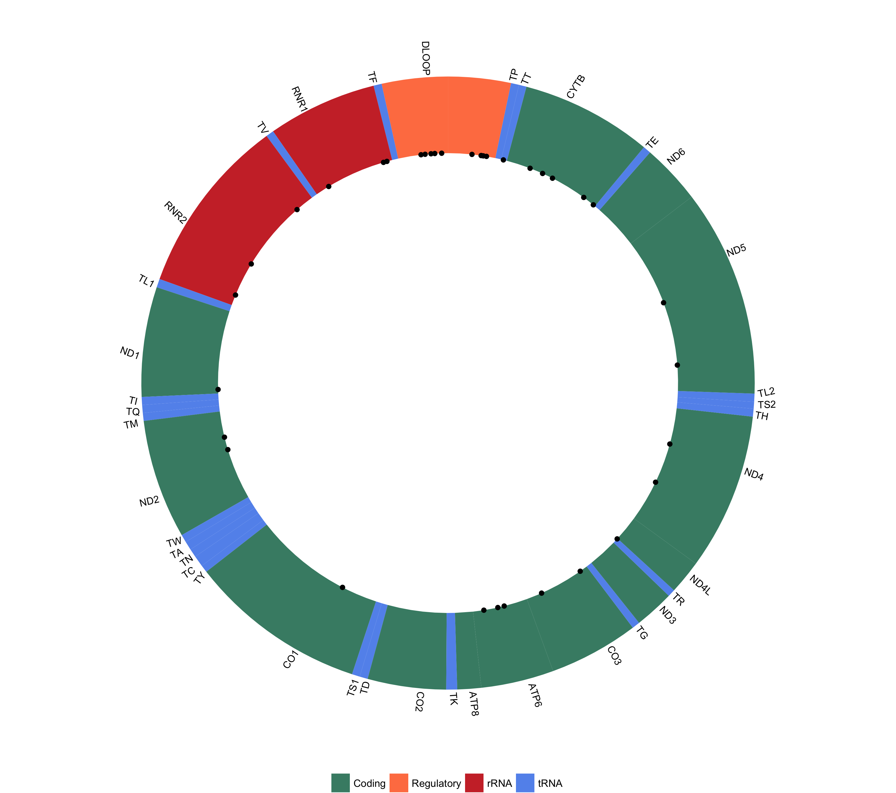
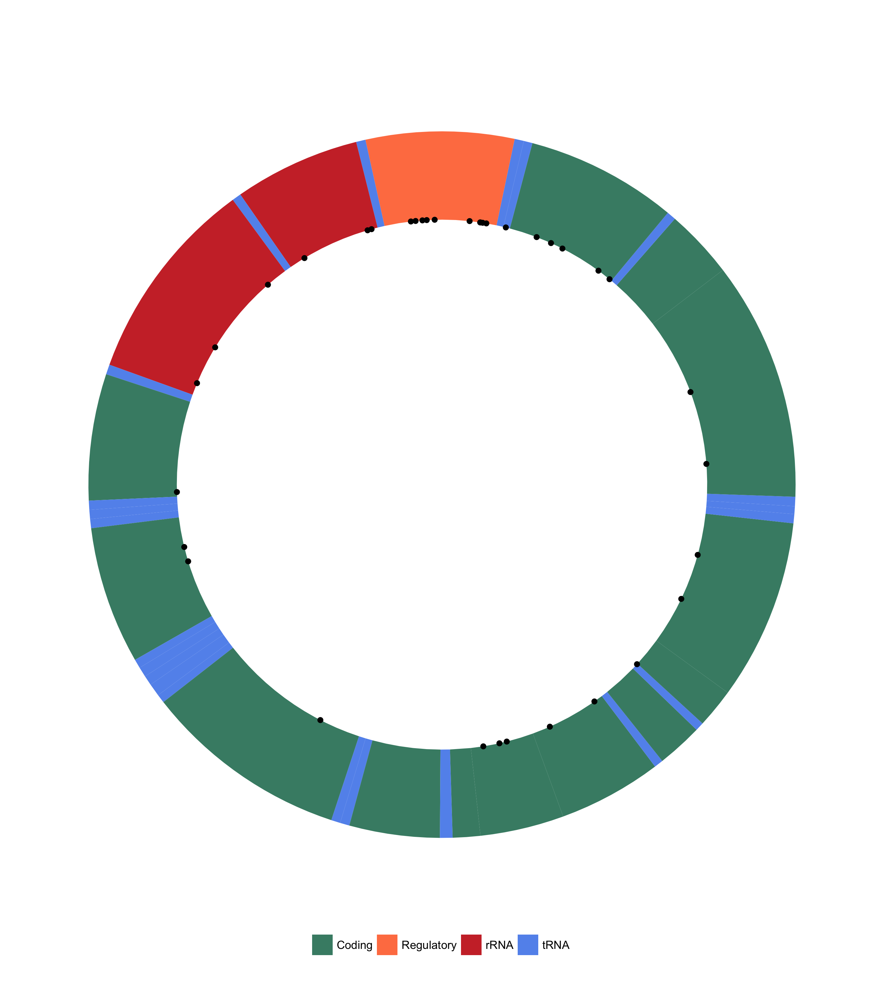
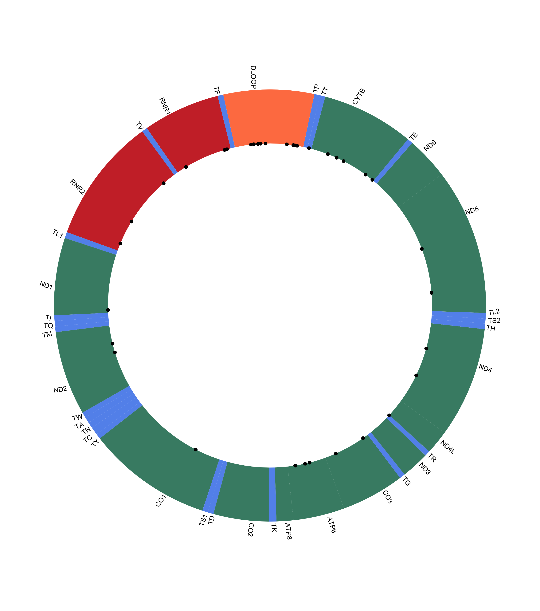

```{r setup, include=FALSE}
knitr::opts_chunk$set(echo = TRUE)
```

# mitovizR  

Plot variants on the human mitochondrial genome. Currently supports plotting variants contained in VCF files.  

## Overview  

mitovizR is a simple tool to plot human mitochondrial variants on a graphical representation of the human mitochondrial genome. It currently supports plotting variants stored in a VCF file, although other options are being developed (if you want to contribute, you're welcome!).  

## Installation  

mitovizR can be installed from GitHub using `devtools`:  

```{r, eval=FALSE}
devtools::install_github("robertopreste/mitovizR")
```

Official installation from CRAN coming soon!  

## Usage  

First of all, load the `mitovizR` package:  

```{r, eval=FALSE}
library(mitovizR)
```

The `plot_vcf` function allows to plot human mitochondrial variants contained in a VCF file. In this example, a VCF file named "HG00119.vcf" and present in the current working directory is used:  

```{r, eval=FALSE}
plot_vcf("HG00119.vcf")
```



It is also possible to specify whether the plot will show loci names and/or loci legend:  

```{r, eval=FALSE}
# do not show loci names
plot_vcf("HG00119.vcf", show_loci_names = FALSE)
```



```{r, eval=FALSE}
# do not show loci legend 
plot_vcf("HG00119.vcf", show_loci_legend = FALSE)
```



By default, the plot will be returned and shown; if you want to save the plot to a file, just use the `save_plot` option:  

```{r, eval=FALSE}
plot_vcf("HG00119.vcf", save_plot = TRUE)
```

This will create a file named `mitoviz_plot.png` in the current working directory.  

## Help  

If you found a bug, or want to suggest an improvement, please feel free to open an [issue](https://github.com/robertopreste/mitovizR/issues).  

## Todo  

* ~~Add option to set title to plot~~  
* Add option to save plot to custom location and filename  
* Plot variants from BED files  

