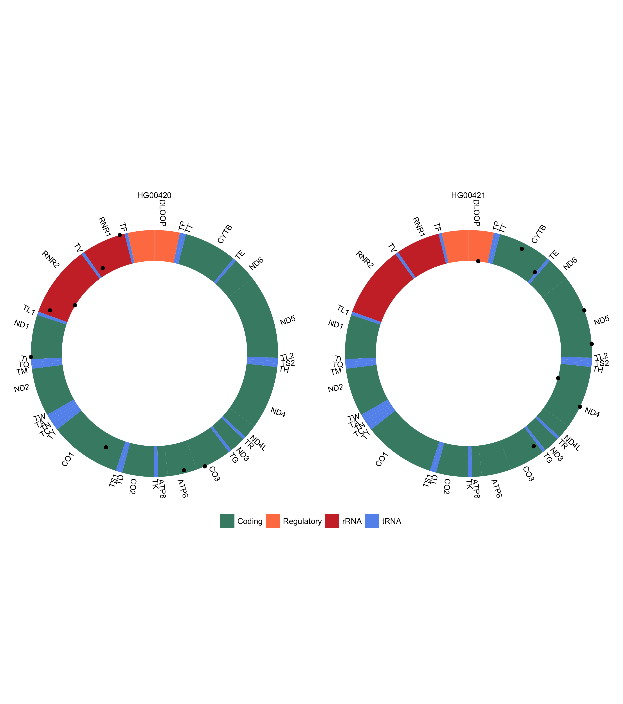
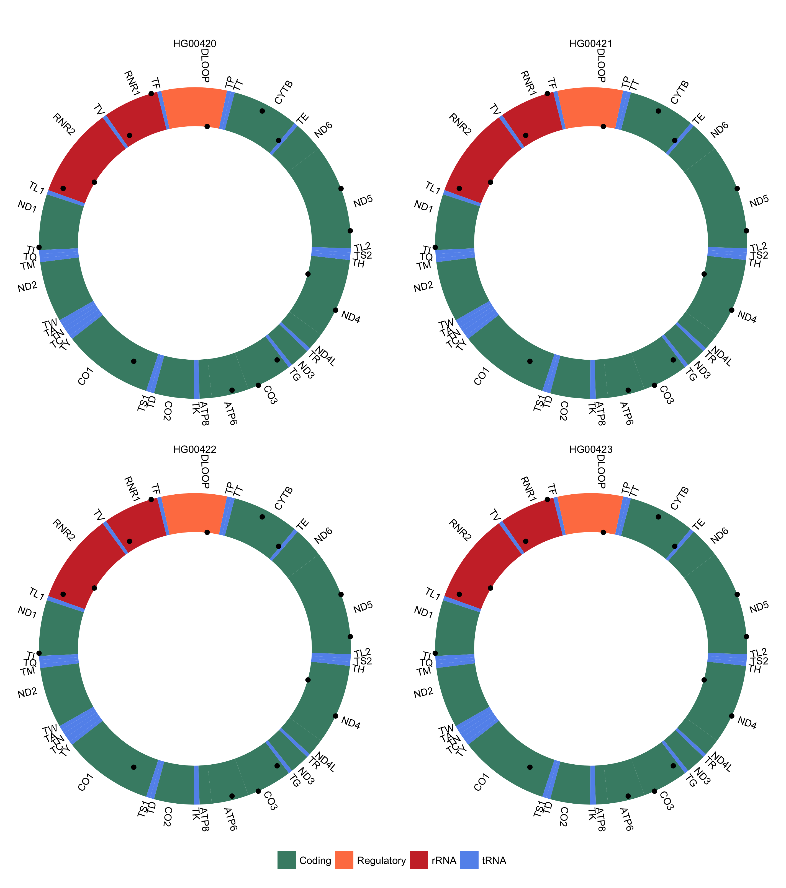

mitovizR
========

[](https://www.repostatus.org/#wip) [](https://travis-ci.com/robertopreste/mitovizR) [](https://codecov.io/gh/robertopreste/mitovizR)

Plot variants on the human mitochondrial genome. Currently supports plotting variants contained in dataframes, VCF or JSON files.

------------------------------------------------------------------------

Overview
--------

mitovizR is a simple R package to plot human mitochondrial variants on a graphical representation of the human mitochondrial genome. It currently supports plotting variants stored in a dataframe or a VCF or JSON file, although other options are being developed (if you want to contribute, you're welcome!).

### Features

-   Plot variants from a dataframe
-   Plot variants from a VCF file
    -   with a single sample
    -   with multiple samples (multiple facets will be produced in the same plot)
    -   showing Heteroplasmic Fraction of each variant
-   Plot variants from a JSON file
    -   from a list of variants
    -   from a list with a dictionary for each variant

------------------------------------------------------------------------

Installation
------------

mitovizR can be installed in R from GitHub using `devtools`:

``` r
devtools::install_github("robertopreste/mitovizR")
```

It is suggested to also build the package vignette when installing `mitovizR`, where all the functionalities are better explained:

``` r
devtools::install_github("robertopreste/mitovizR", build_vignettes = TRUE)
```

Official installation from CRAN/Bioconductor coming soon!

Usage
-----

First of all, load the `mitovizR` package:

``` r
library(mitovizR)
```

The `mitovizR` package offers three main functions to plot variants from three different sources:

``` r
plot_df()    # to plot variants from a dataframe 
plot_vcf()   # to plot variants from a VCF file 
plot_json()  # to plot variants from a JSON file 
```

Further details about their usage and options may be found in the package vignette, which can be built using `devtools::install_github("robertopreste/mitovizR", build_vignettes = TRUE)`.

**Under construction!**

### Plot variants from a dataframe

The simplest example is when you already have a dataframe with a set of mitochondrial variants.

|    POS| REF | ALT | SAMPLE  | GT  | HF    |
|------:|:----|:----|:--------|:----|:------|
|    750| A   | G   | HG00420 | 0/1 | 0.998 |
|   1438| A   | G   | HG00420 | 0/1 | 0.232 |
|   2706| A   | G   | HG00420 | 0/1 | 0.015 |
|   3106| CN  | C   | HG00420 | 0/1 | 0.66  |
|   4216| T   | C   | HG00420 | 1   | 1.0   |
|   7028| C   | T   | HG00420 | 0/1 | 0.420 |
|   8935| C   | T   | HG00420 | 0/1 | 0.899 |
|   9389| A   | G   | HG00420 | 1   | 1.0   |
|   9899| T   | C   | HG00420 | 0/1 | 0.670 |
|  11251| A   | G   | HG00420 | 0/1 | 0.999 |
|  11719| G   | A   | HG00420 | 0/1 | 0.008 |
|  12633| C   | A   | HG00420 | 0/1 | 0.998 |
|  13368| G   | A   | HG00420 | 1   | 1.0   |
|  14766| C   | T   | HG00420 | 0/1 | 0.398 |
|  15326| A   | G   | HG00420 | 0/1 | 0.804 |
|  16294| C   | T   | HG00420 | 0/1 | 0.008 |

In this case, a call to `plot_df()` will plot all mitochondrial variants.

``` r
plot_df(sample_df)
```


It is possible to show a label on each variant with its position, reference and alternate allele, using the `show_var_labels` option. In this case, by default the `plot_df()` function will look for columns named `POS`, `REF` and `ALT`, containing respectively variant positions, reference alleles and alternate alleles; you can specify different column names using respectively the `pos_col`, `ref_col` and `alt_col` options.

``` r
plot_df(sample_df, show_var_labels = TRUE)
# specify the variant positions, reference and alternate alleles column names
plot_df(sample_df, show_var_labels = TRUE, 
        pos_col = "POS", ref_col = "REF", alt_col = "ALT")
```


Variants are shown according to their heteroplasmic fraction (HF), plotting variants with HF = 1.0 on the outer border of the mitochondrial circle, those with HF = 0.0 on the inner border and all the others according to their actual HF value. This is done automatically if a column with heteroplasmic fraction values is present (by default `HF`, if not set differently using the `hf_col` option); otherwise, variants will simply be shown in the middle of the circular plot (as if they all had HF = 0.5).

`plot_df()` deal with a dataframe with multiple samples easily, creating a separate plot for each sample listed in the `SAMPLE` column (this default can be changed using the `sample_col` option).

``` r
plot_df(sample_multi_df)
# specify the sample column name 
plot_df(sample_multi_df, sample_col = "sample_column")
```



By default, the plot will be returned and shown; if you want to save the plot to a file, just use the `save_plot` option, which will save the current plot to `./mitoviz_plot.png`. You can specify a custom output path and filename using the `save_to` option.

``` r
plot_df(sample_df, save_plot = TRUE)
# specify a custom output path
plot_df(sample_df, save_plot = TRUE, save_to = "../my_dir/my_plot.png")
```

### Plot variants from a VCF file

The `plot_vcf()` function allows to plot human mitochondrial variants contained in a VCF file.

``` r
plot_vcf("sample_vcf.vcf")
```


Multiple plots are automatically created from a multi-sample VCF file.

``` r
plot_vcf("sample_multi.vcf")
```



### Plot variants from a JSON file

Some tools will output mitochondrial variants in a JSON-formatted file; in this case, the `plot_json()` function is what you need. JSON files can usually be in two different formats:

-   vector format, where variant positions are simply stored in a vector
-   dataframe format, where each variant is stored in its own entry

The `plot_json()` function can handle both cases, using a different argument for its `json_format` option.

#### Vector-formatted JSON files

An example of a vector-formatted JSON file is the following:

``` r
# content of json_vector.json
["420", "1000", "3000", "5000", "10000"]
```

Using `json_format = "vector"` allows to plot variants from this file.

``` r
plot_json("json_vector.json", json_format = "vector")
```


#### Dataframe-formatted JSON files

An example of a dataframe-formatted JSON file is the following:

``` r
# content of json_dataframe.json
[
  {"feat1": "snp", "position": 420},
  {"feat1": "snp", "position": 1000},
  {"feat1": "snp", "position": 3000},
  {"feat1": "snp", "position": 5000},
  {"feat1": "snp", "position": 10000}
]
```

In this case, just set `json_format = "dataframe"`. By default, the `plot_json()` function will look for a `POS` column with variant positions, but you can specify a different column name using the `pos_col` option.

``` r
plot_json("json_dataframe.json", json_format = "dataframe", pos_col = "position")
```


Help
----

If you found a bug, or want to suggest an improvement, please feel free to open an [issue](https://github.com/robertopreste/mitovizR/issues).
