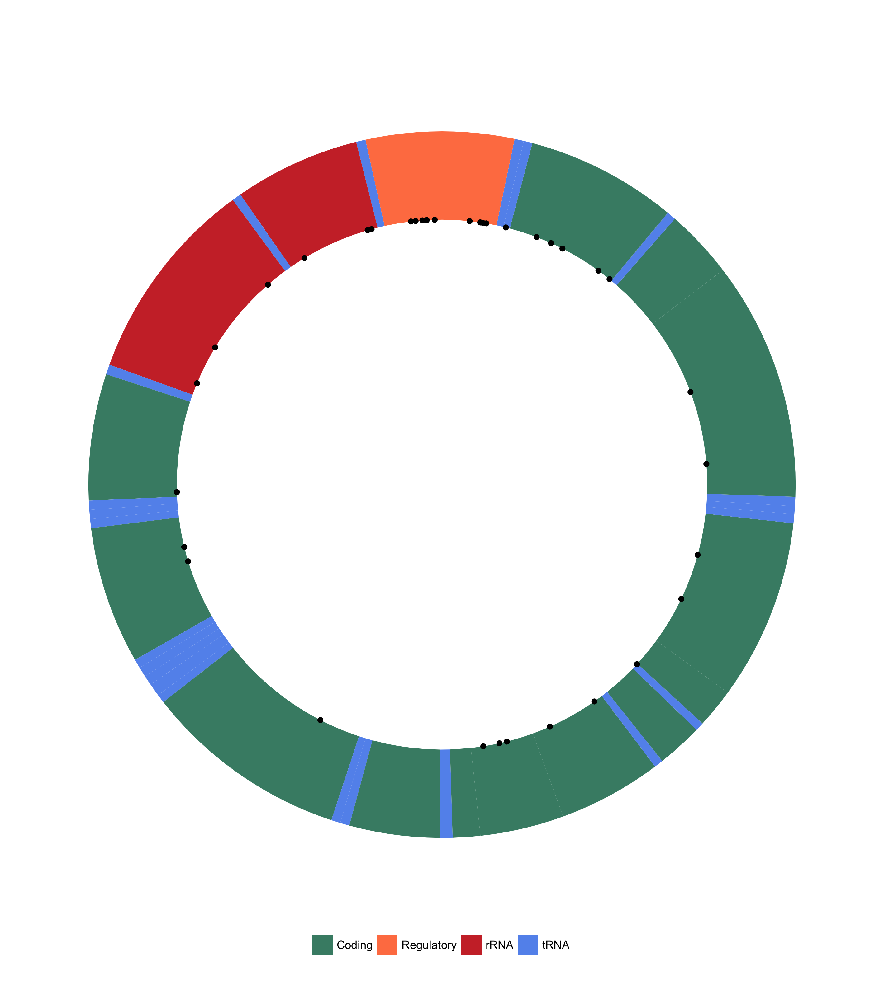
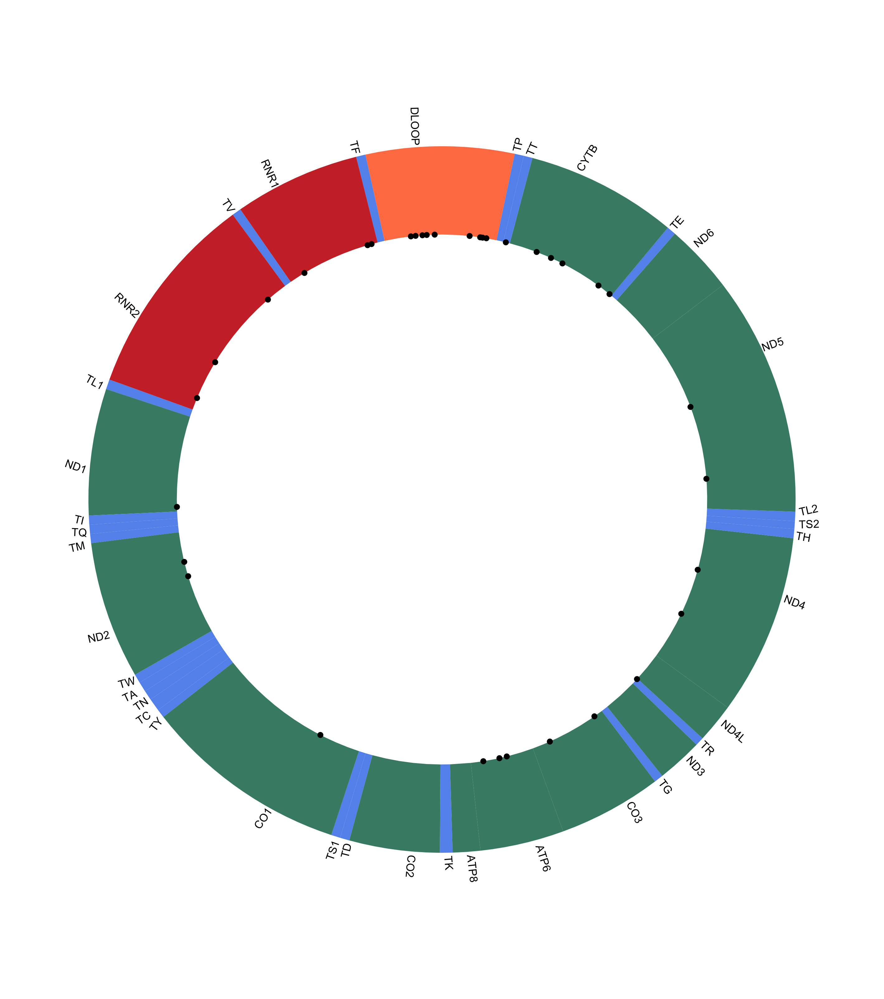

mitovizR
========

Plot variants on the human mitochondrial genome. Currently supports plotting variants contained in dataframes, VCF or JSON files.

Overview
--------

mitovizR is a simple tool to plot human mitochondrial variants on a graphical representation of the human mitochondrial genome. It currently supports plotting variants stored in a dataframe or a VCF or JSON file, although other options are being developed (if you want to contribute, you're welcome!).

Installation
------------

mitovizR can be installed from GitHub using `devtools`:

``` r
devtools::install_github("robertopreste/mitovizR")
```

Official installation from CRAN coming soon!

Usage
-----

First of all, load the `mitovizR` package:

``` r
library(mitovizR)
```

The simplest example is when you already have a dataframe with a set of mitochondrial variants. In this case, a call to `plot_df` will plot all mitochondrial variants; by default, this function will look for a `POS` column containing variants position, but custom column names can be specified using the `pos_col` option.

``` r
minidf 
```

| CHROM |    POS| ID  | REF | ALT | QUAL | FILTER |
|:------|------:|:----|:----|:----|:-----|:-------|
| chrMT |    709| NA  | G   | A   | NA   | PASS   |
| chrMT |    750| NA  | A   | G   | NA   | PASS   |
| chrMT |   1438| NA  | A   | G   | NA   | PASS   |
| chrMT |   3106| NA  | CN  | C   | NA   | PASS   |
| chrMT |   4769| NA  | A   | G   | NA   | PASS   |
| chrMT |   7028| NA  | C   | T   | NA   | PASS   |
| chrMT |   9389| NA  | A   | G   | NA   | PASS   |
| chrMT |  11719| NA  | G   | A   | NA   | PASS   |
| chrMT |  14905| NA  | G   | A   | NA   | PASS   |
| chrMT |  15452| NA  | C   | A   | NA   | PASS   |

``` r
plot_df(minidf)
```


It is possible to show a label on each variant with its position, reference and alternate allele, using the `show_var_labels` option.

``` r
plot_df(minidf, show_var_labels = TRUE)
```


The `plot_vcf` function allows to plot human mitochondrial variants contained in a VCF file. In this example, a VCF file named "HG00119.vcf" and present in the current working directory is used:

``` r
plot_vcf("HG00119.vcf")
```


It is also possible to specify whether the plot will show loci names and/or loci legend:

``` r
# do not show loci names
plot_vcf("HG00119.vcf", show_loci_names = FALSE)
```



``` r
# do not show loci legend 
plot_vcf("HG00119.vcf", show_loci_legend = FALSE)
```



A specific title can be added to the plot using the `title` option:

``` r
plot_vcf("HG00119.vcf", title = "My mito plot")
```


By default, the plot will be returned and shown; if you want to save the plot to a file, just use the `save_plot` option:

``` r
plot_vcf("HG00119.vcf", save_plot = TRUE)
```

This will create a file named `mitoviz_plot.png` in the current working directory.

It is also possible to save the plot to a specific path and/or with a custom filename, using the `save_to` option:

``` r
plot_vcf("HG00119.vcf", save_plot = TRUE, save_to = "my_folder/my_plot_name.png")
```

Help
----

If you found a bug, or want to suggest an improvement, please feel free to open an [issue](https://github.com/robertopreste/mitovizR/issues).

Todo
----

-   Plot variants from [HmtDB](https://www.hmtdb.uniba.it) JSON
-   Plot variants from BED files
